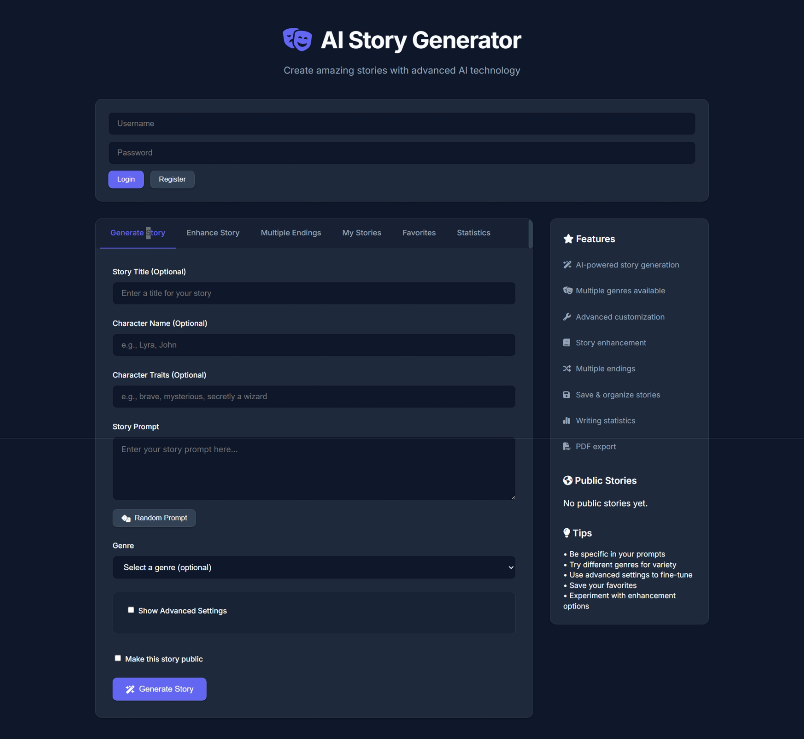

# AI Story Generator

A modern, fast, and sleek Flask web application that uses Google's Gemini AI to generate incredibly creative stories based on user prompts. Completely overhauled with a premium Dark Mode aesthetic, real-time streaming, and AI cover image generation.



## New Features & Upgrades

### Cloud AI Integration
- **Google Gemini API**: Replaced heavy local models with the lightning-fast `gemini-1.5-flash` model, requiring zero local compute power.
- **Real-Time Streaming**: Watch your stories type out word-by-word instantly with Server-Sent Events (SSE). No more waiting for loading spinners!
- **Rich Text Formatting**: Stories are now beautifully formatted using Markdown (bolding, italics, headers) via `marked.js`.

### Premium Aesthetic Overhaul
- **Sleek Dark Mode**: Designed with a professional Slate/Zinc color palette inspired by modern SaaS applications.
- **Refined Surfaces**: Solid dark cards with subtle borders and elegant drop-shadows have replaced clunky layouts.
- **AI Cover Images**: Automatically generates and displays a unique, gorgeous cover illustration for every story using the Pollinations.ai API.

### Creative Tools
- **Genre-Specific Prompts**: Choose from fantasy, sci-fi, mystery, romance, horror, adventure, and comedy.
- **Multiple Endings**: Generate alternative endings for your stories.
- **Story Enhancement**: Improve existing stories with more detail, dialogue, emotion, or action.
- **Random Prompt Generator**: Get inspired with creative writing prompts.

### User Management & Export
- **User Authentication**: Secure account creation with password hashing.
- **Story Library & Favorites**: Save, organize, and favorite your generated stories.
- **Public/Private Sharing**: Share stories with the community or keep them private.
- **PDF Export**: Download your favorite stories as formatted PDF documents.

## Installation

### Prerequisites
- Python 3.7 or higher
- A free [Google Gemini API Key](https://aistudio.google.com/app/apikey)

### Quick Setup (Windows)
1. **Clone or download** the project files.
2. **Set up your API Key**:
   - Create a file named `.env` in the root folder.
   - Add your key like this: `GEMINI_API_KEY="your_api_key_here"`
3. **Run the setup script**:
   ```bash
   setup.bat
   ```
   This will automatically:
   - Create a virtual environment
   - Install all lightweight dependencies
   - Launch the Flask server
   - Open your browser to the application

### Manual Setup (All Platforms)

1. **Create a virtual environment**:
   ```bash
   python -m venv venv
   ```

2. **Activate the virtual environment**:
   - Windows: `venv\Scripts\activate`
   - macOS/Linux: `source venv/bin/activate`

3. **Install dependencies**:
   ```bash
   pip install -r requirements.txt
   ```

4. **Add your API Key**:
   Create a `.env` file and add `GEMINI_API_KEY="your_api_key_here"`.

5. **Run the application**:
   ```bash
   python app.py
   ```

6. **Open your browser** to `http://localhost:5000`

## Dependencies

The application uses incredibly lightweight packages, meaning it installs in seconds:

```
Flask - Web framework
google-genai - Google Gemini Cloud API
python-dotenv - Environment variable management
Werkzeug - WSGI utilities
reportlab - PDF generation
requests - HTTP library
Pillow - Image processing
```

## Security Note
Never commit your `.env` file to version control. The `.gitignore` file has been configured to automatically ignore it to keep your Google Gemini API key safe.
