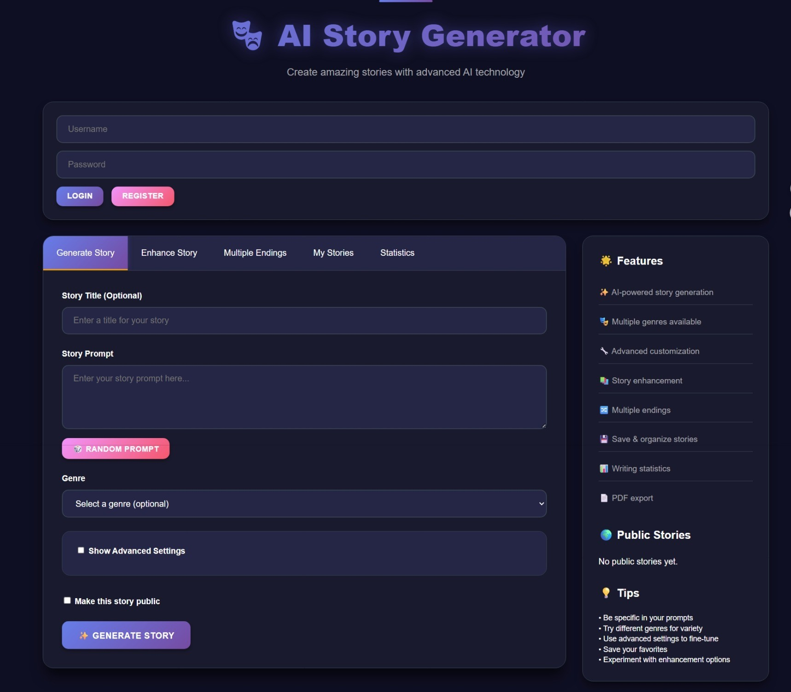
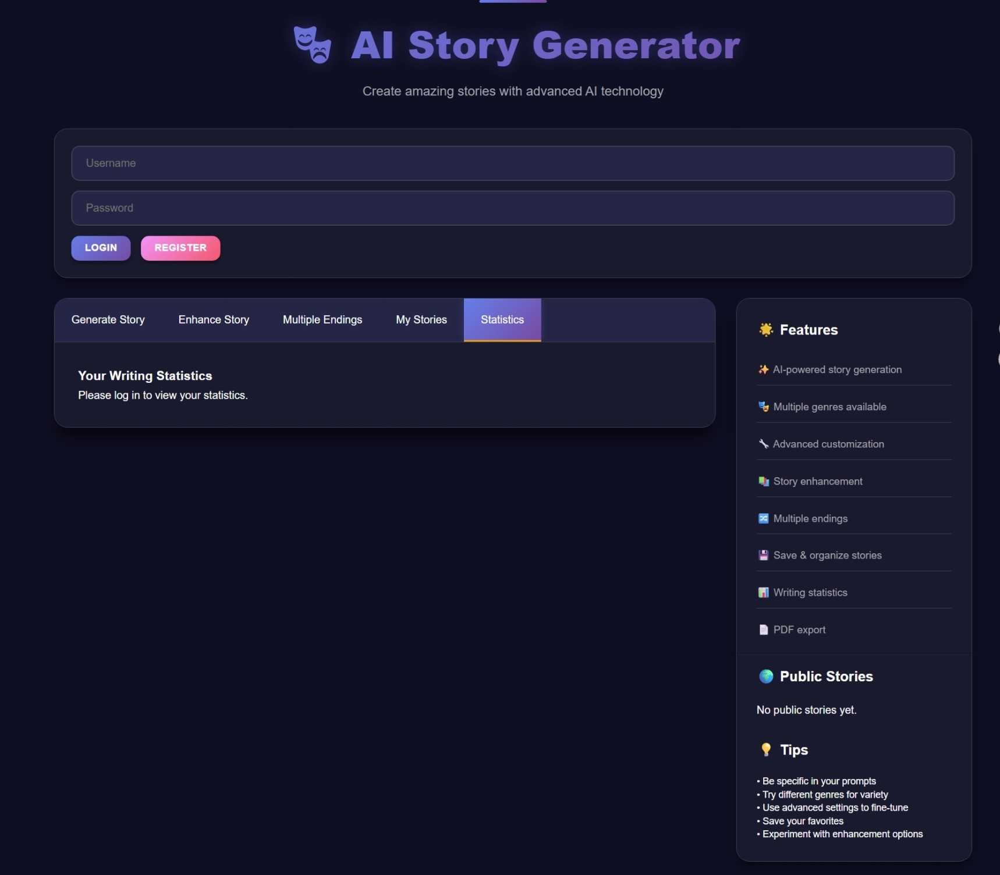
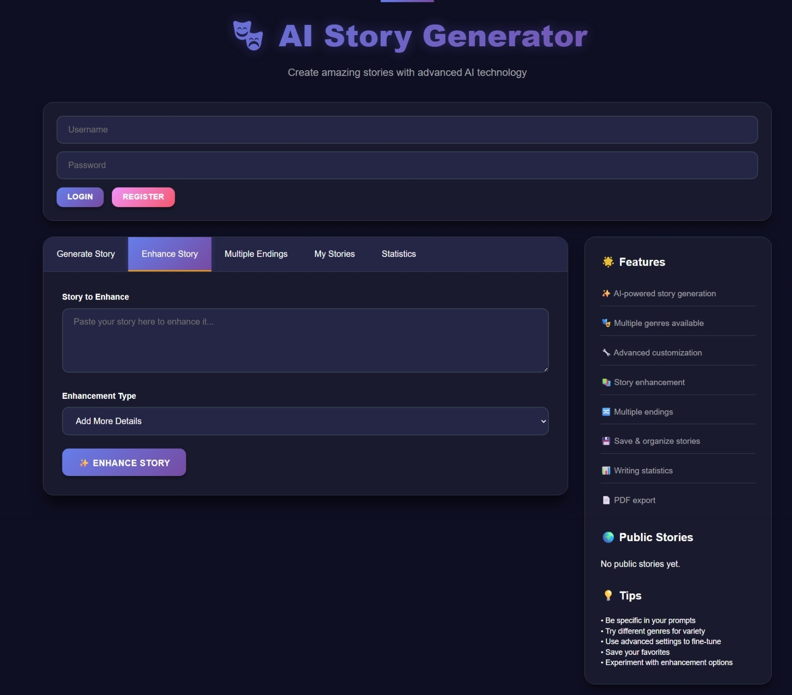
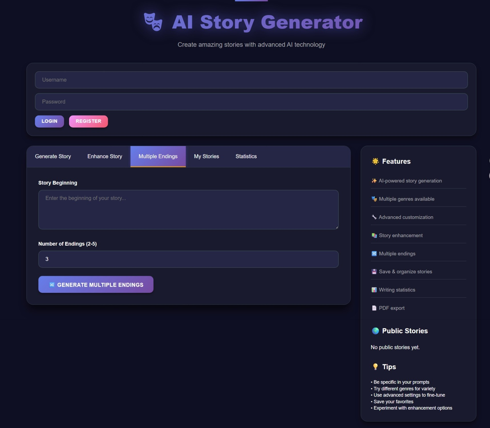
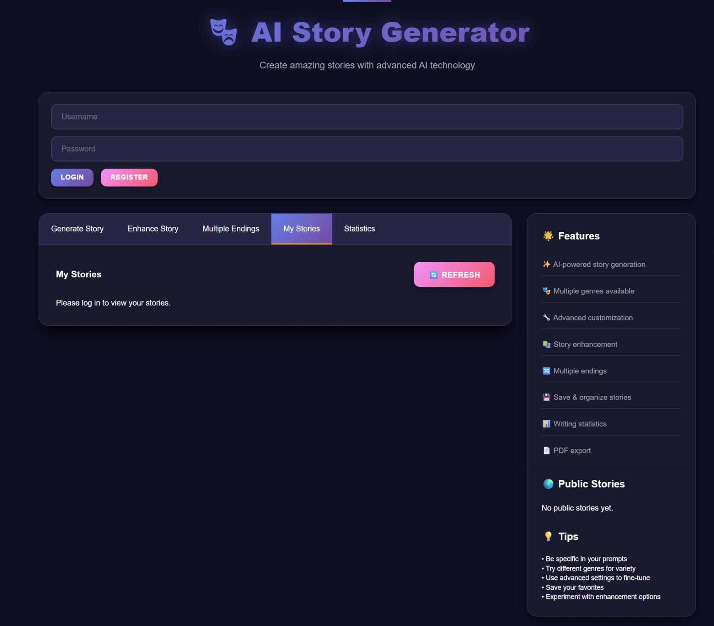

# Flask AI Story Generator 📚✨

A powerful Flask web application that uses AI to generate creative stories based on user prompts. Built with GPT-2 and featuring user authentication, story management, and multiple creative writing tools.

 
 
 
 
## Features

### 🤖 AI Story Generation
- **GPT-2 Medium Model**: Uses advanced AI to generate creative stories
- **Genre-Specific Prompts**: Choose from fantasy, sci-fi, mystery, romance, horror, adventure, and comedy
- **Customizable Parameters**: Adjust story length, creativity (temperature), and coherence (top_p)
- **Multiple Endings**: Generate alternative endings for your stories
- **Story Enhancement**: Improve existing stories with more detail, dialogue, emotion, or action

### 👤 User Management
- **User Registration & Login**: Secure account creation with password hashing
- **Story Library**: Save and organize your generated stories
- **Public/Private Stories**: Share stories with the community or keep them private
- **Story Statistics**: Track your writing progress and genre preferences

### 📄 Export & Sharing
- **PDF Export**: Download stories as formatted PDF documents
- **Story Collections**: Organize favorite stories
- **Community Hub**: Browse and discover public stories from other users

### 🎲 Creative Tools
- **Random Prompt Generator**: Get inspired with creative writing prompts
- **Story Analytics**: View word counts, genre distribution, and writing statistics
- **Model Information**: Monitor AI model status and performance


 
 
 
 
 

## Installation

### Prerequisites
- Python 3.7 or higher
- pip (Python package manager)

### Quick Setup (Windows)
1. **Clone or download** the project files
2. **Run the setup script**:
   ```bash
   setup.bat
   ```
   This will automatically:
   - Check for Python installation
   - Create a virtual environment
   - Install all dependencies
   - Launch the Flask server
   - Open your browser to the application

### Manual Setup (All Platforms)

1. **Create a virtual environment**:
   ```bash
   python -m venv venv
   ```

2. **Activate the virtual environment**:
   - Windows: `venv\Scripts\activate`
   - macOS/Linux: `source venv/bin/activate`

3. **Install dependencies**:
   ```bash
   pip install -r requirements.txt
   ```

4. **Run the application**:
   ```bash
   python app.py
   ```

5. **Open your browser** to `http://localhost:5000`

## Dependencies

The application requires the following Python packages:

```
Flask - Web framework
torch - PyTorch for AI model
transformers - Hugging Face transformers library
Werkzeug - WSGI utilities
reportlab - PDF generation
numpy - Numerical computing
tokenizers - Text tokenization
huggingface-hub - Model repository access
accelerate - Model optimization
protobuf - Protocol buffers
requests - HTTP library
Pillow - Image processing
```

## Project Structure

```
flask-story-generator/
├── app.py                 # Main Flask application
├── requirements.txt       # Python dependencies
├── setup.bat             # Windows setup script
├── stories.db            # SQLite database (auto-created)
├── models/               # Local AI model storage
│   └── gpt2_medium/      # GPT-2 model files
├── templates/            # HTML templates
│   └── index.html        # Main web interface
└── static/               # Static files (CSS, JS, images)
    ├── css/
    │   └── styles.css
    └── js/
        └── app.js
```

## Usage Guide

### Getting Started
1. **Launch the application** using `setup.bat` or manual setup
2. **Register an account** or continue as a guest
3. **Enter a story prompt** in the main interface
4. **Select genre and parameters** (optional)
5. **Generate your story** and enjoy!

### Story Generation Options
- **Prompt**: Your creative starting point
- **Genre**: Choose from 7 different genres for themed stories
- **Max Length**: Control story length (50-1000 words)
- **Temperature**: Adjust creativity (0.1-1.0)
- **Top P**: Control coherence (0.1-1.0)

### Advanced Features
- **Story Enhancement**: Improve existing stories with different focus areas
- **Multiple Endings**: Generate 3-5 alternative endings
- **Random Prompts**: Get inspiration from built-in prompt generator
- **PDF Export**: Download stories as formatted documents

## API Endpoints

### Story Generation
- `POST /generate` - Generate a new story
- `POST /enhance` - Enhance an existing story
- `POST /multiple-endings` - Generate multiple story endings

### User Management
- `POST /register` - User registration
- `POST /login` - User login
- `POST /logout` - User logout

### Story Management
- `GET /my-stories` - Get user's saved stories
- `GET /public-stories` - Get public stories
- `GET /story-stats` - Get user's story statistics

### Utilities
- `GET /random-prompt` - Get a random story prompt
- `GET /model-info` - Get AI model information
- `GET /health` - Health check endpoint
- `GET /export-pdf/<story_id>` - Export story as PDF

## Configuration

### Model Settings
The application uses GPT-2 Medium model by default. You can modify model settings in `app.py`:

```python
self.model_name = "gpt2-medium"  # Change model size
self.models_dir = "./models"     # Local model storage
```

### Security
Change the secret key in `app.py` for production:
```python
app.secret_key = 'your-secure-secret-key-here'
```

## Database Schema

The application uses SQLite with the following tables:

### Users
- `id` - Primary key
- `username` - Unique username
- `email` - User email
- `password_hash` - Hashed password
- `created_at` - Account creation timestamp

### Stories
- `id` - Unique story identifier
- `user_id` - Foreign key to users
- `title` - Story title
- `prompt` - Original prompt
- `story` - Generated story text
- `genre` - Story genre
- `word_count` - Number of words
- `rating` - Story rating
- `created_at` - Creation timestamp
- `is_public` - Public/private flag

### Favorites
- `id` - Primary key
- `user_id` - Foreign key to users
- `story_id` - Foreign key to stories
- `created_at` - Favorite timestamp

## Troubleshooting

### Common Issues

1. **Model Download Fails**
   - Ensure stable internet connection
   - Check disk space (model is ~500MB)
   - Try running again - download will resume

2. **CUDA/GPU Issues**
   - Application works on CPU by default
   - GPU acceleration is automatic if available
   - No configuration needed

3. **Port Already in Use**
   - Change port in `app.py`: `app.run(port=5001)`
   - Or kill process using port 5000

4. **Database Issues**
   - Database is auto-created on first run
   - Delete `stories.db` to reset database
   - Check file permissions

### Performance Tips
- First story generation may be slow (model loading)
- Subsequent generations are much faster
- Lower max_length for faster generation
- GPU significantly improves performance

## Contributing

Feel free to contribute to this project! Areas for improvement:
- Additional AI models
- More story genres
- Enhanced UI/UX
- Story collaboration features
- Mobile responsiveness

## Support

For issues or questions:
1. Check the troubleshooting section
2. Review the console output for error messages
3. Ensure all dependencies are installed correctly
4. Check that Python version is 3.7+

## Technical Details

### AI Model
- **Model**: GPT-2 Medium (355M parameters)
- **Framework**: Hugging Face Transformers
- **Storage**: Local caching for faster loading
- **Inference**: PyTorch backend with CPU/GPU support

### Web Framework
- **Backend**: Flask (Python web framework)
- **Database**: SQLite (embedded database)
- **Authentication**: Session-based with password hashing
- **PDF Generation**: ReportLab library

### Performance
- **Model Size**: ~500MB download
- **Memory Usage**: ~2GB RAM during generation
- **Generation Speed**: 2-10 seconds per story
- **Concurrent Users**: Depends on server resources

---

**Happy Story Writing! 🎉**

Transform your ideas into engaging stories with the power of AI. Whether you're a creative writer, educator, or just someone who loves stories, this tool is designed to spark your imagination and bring your ideas to life.
